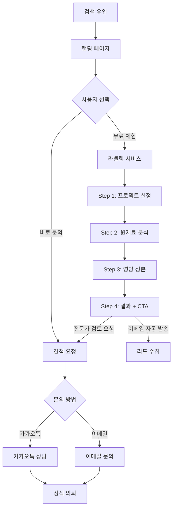

# User Flow (사용자 흐름도)

> 새봄컨설팅 - 사용자 여정 및 화면 흐름

---

## 1. 전체 사용자 여정

```
┌─────────────────────────────────────────────────────────────────────────────┐
│                              사용자 여정 맵                                   │
├─────────────────────────────────────────────────────────────────────────────┤
│                                                                              │
│  [인지]                [탐색]              [체험]              [전환]        │
│    │                    │                   │                   │           │
│    ▼                    ▼                   ▼                   ▼           │
│  ┌────┐            ┌────────┐          ┌────────┐          ┌────────┐      │
│  │검색│ ──────────▶│ 랜딩   │─────────▶│ 라벨링 │─────────▶│ 견적   │      │
│  │유입│            │ 페이지 │          │ 서비스 │          │ 요청   │      │
│  └────┘            └────────┘          └────────┘          └────────┘      │
│    │                    │                   │                   │           │
│    │                    │                   │                   │           │
│  "FDA 인증           가격 확인           라벨 초안           카카오톡       │
│   비용" 검색          실적 확인           직접 생성           상담 연결      │
│                      전문성 확인          무료 체험           정식 의뢰      │
│                                                                              │
└─────────────────────────────────────────────────────────────────────────────┘
```

---

## 2. 주요 흐름별 상세

### 2.1 메인 전환 흐름 (Happy Path)



### 2.2 랜딩 페이지 스크롤 흐름

```
┌─────────────────────────────────────────────────────────────────┐
│                         랜딩 페이지                              │
├─────────────────────────────────────────────────────────────────┤
│                                                                  │
│  [1] 히어로 섹션                                                │
│      "AI로 더 빠르게, 관세사로 더 정확하게"                     │
│      [무료 견적 받기] ─────────────────────────┐                │
│                                                │                │
│  [2] 핵심 가치 제안 (4카드)                    │                │
│      AI+전문관세사 | 합리적 비용 |              │                │
│      빠른 처리 | 원스톱 지원                    │                │
│                                                │                │
│  [3] 서비스 소개                               │                │
│      FDA | EU | 일본                           │                │
│                                                │                │
│  [4] 무료 라벨링 섹션                          │                │
│      [무료 라벨링 체험하기] ──────────────────(라벨링 페이지)   │
│                                                │                │
│  [5] 프로세스 (4단계)                          │                │
│                                                │                │
│  [6] 실적 섹션                                 │                │
│                                                │                │
│  [7] 고객 문제 해결                            │                │
│                                                │                │
│  [8] 차별점 상세                               │                │
│                                                │                │
│  [9] FAQ                                       │                │
│                                                │                │
│  [10] 견적 요청 CTA                            │                │
│       [무료 견적 받기] ◀───────────────────────┘                │
│       [카카오톡 상담하기]                                        │
│                                                                  │
│  [Footer]                                                        │
│                                                                  │
└─────────────────────────────────────────────────────────────────┘
```

### 2.3 라벨링 서비스 흐름

```
┌─────────────────────────────────────────────────────────────────┐
│                      무료 라벨링 서비스                          │
│                     (Global Label AI)                           │
├─────────────────────────────────────────────────────────────────┤
│                                                                  │
│  ┌──────────────────────────────────────────────────────────┐   │
│  │ Progress: [1]───[2]───[3]───[4]                          │   │
│  └──────────────────────────────────────────────────────────┘   │
│                                                                  │
│  [Step 1: 프로젝트 설정]                                        │
│  ├─ 이메일 입력 (필수) ← 리드 수집                              │
│  ├─ 제품명                                                      │
│  ├─ 수출 대상 마켓 (EU / US)                                    │
│  └─ 판매 언어                                                   │
│                              │                                  │
│                              ▼                                  │
│  [Step 2: 원재료 분석]                                          │
│  ├─ 원재료명 + 함량(%) 입력                                     │
│  ├─ 중량 순 자동 정렬                                           │
│  └─ 알러지 성분 자동 감지                                       │
│                              │                                  │
│                              ▼                                  │
│  [Step 3: 영양 성분 변환]                                       │
│  ├─ 8가지 영양성분 입력 (100g 기준)                             │
│  ├─ EU: 나트륨 → 소금 자동 변환                                 │
│  └─ EU: kcal → kJ 자동 병기                                     │
│                              │                                  │
│                              ▼                                  │
│  [Step 4: 최종 라벨 출력]                                       │
│  ├─ 라벨 텍스트 초안                                            │
│  ├─ 규정 준수 체크리스트                                        │
│  ├─ [텍스트 복사] [PDF 다운로드]                                │
│  └─ [전문가 검토 받기] ─────────────────────▶ 견적 요청 모달   │
│                              │                                  │
│                              ▼                                  │
│              newbom@newbom.co.kr로 자동 메일 발송               │
│                                                                  │
└─────────────────────────────────────────────────────────────────┘
```

---

## 3. 이탈 방지 포인트

### 3.1 주요 이탈 지점 및 대응

| 지점            | 예상 이탈 이유   | 대응 방안                           |
| --------------- | ---------------- | ----------------------------------- |
| 히어로 섹션     | 관심 없음        | 명확한 가치 제안 (가격, 기간)       |
| 가격 확인 후    | "너무 싸서 의심" | 관세사 자격/보험 강조               |
| 라벨링 Step 1   | 이메일 입력 거부 | "마케팅 동의" 투명하게, 필수 최소화 |
| 라벨링 Step 2~3 | 입력이 번거로움  | 샘플 데이터 제공, 진행률 표시       |
| 라벨링 결과 후  | 무료만 쓰고 이탈 | CTA 강조, 이메일 후속 마케팅        |

### 3.2 CTA 배치 전략

```
랜딩 페이지 CTA 위치:
- 히어로 섹션: [무료 견적 받기]
- 서비스 섹션: [자세히 보기] → 섹션으로 스크롤
- 라벨링 섹션: [무료 라벨링 체험하기]
- 하단 CTA: [무료 견적 받기] [카카오톡 상담하기]
- Sticky Header: [무료 견적 받기] (스크롤 시)

라벨링 서비스 CTA 위치:
- Step 4 결과 화면: [전문가 검토 받기] [견적 문의하기]
```

---

## 4. 네비게이션 구조

### 4.1 헤더 네비게이션

```
┌─────────────────────────────────────────────────────────────────┐
│  [로고]  서비스  FDA인증  EU통관  일본인증  무료라벨링  [견적받기] │
└─────────────────────────────────────────────────────────────────┘
         │
         ├─ 서비스: 랜딩 내 서비스 섹션으로 스크롤
         ├─ FDA인증: 랜딩 내 FDA 섹션으로 스크롤
         ├─ EU통관: 랜딩 내 EU 섹션으로 스크롤
         ├─ 일본인증: 랜딩 내 일본 섹션으로 스크롤
         ├─ 무료라벨링: /label 페이지로 이동
         └─ 견적받기: 견적 요청 모달/섹션
```

### 4.2 모바일 네비게이션

```
┌───────────────────┐
│  [로고]    [☰]    │
└───────────────────┘
           │
           ▼
┌───────────────────┐
│  서비스           │
│  FDA 인증         │
│  EU 통관          │
│  일본 인증        │
│  무료 라벨링      │
│  ─────────────── │
│  [무료 견적 받기] │
│  [카카오톡 상담]  │
└───────────────────┘
```

---

## 5. 상태별 화면 변화

### 5.1 라벨링 서비스 상태

| 상태        | 화면 변화                         |
| ----------- | --------------------------------- |
| 초기        | Step 1 활성화, 2-3-4 비활성화     |
| Step 1 완료 | Step 2 활성화, 1 완료 표시 (체크) |
| Step 2 완료 | Step 3 활성화, 1-2 완료 표시      |
| Step 3 완료 | Step 4 활성화, 1-2-3 완료 표시    |
| Step 4 완료 | 결과 화면 + 이메일 발송 + CTA     |

### 5.2 에러 상태

| 에러             | 표시 방식             | 복구 방법     |
| ---------------- | --------------------- | ------------- |
| 이메일 형식 오류 | 필드 아래 빨간 메시지 | 재입력        |
| 필수 입력 누락   | 필드 아래 빨간 메시지 | 입력          |
| 이메일 발송 실패 | 토스트 알림           | 재시도 버튼   |
| 네트워크 오류    | 토스트 알림           | 새로고침 안내 |

---

## 6. 외부 연결

### 6.1 외부 링크

| 버튼/링크         | 동작                       | 비고             |
| ----------------- | -------------------------- | ---------------- |
| 카카오톡 상담하기 | 카카오톡 채널 새 탭        | target="\_blank" |
| 이메일 문의       | mailto:newbom@newbom.co.kr | 기본 메일 앱     |

### 6.2 연락처 정보

```
이메일: newbom@newbom.co.kr
카카오톡: (채널 URL)
```

---

## 7. 반응형 고려사항

### 7.1 브레이크포인트별 변화

| 요소           | 모바일 (< 768px) | 태블릿 (768-1024px) | 데스크톱 (> 1024px)   |
| -------------- | ---------------- | ------------------- | --------------------- |
| 네비게이션     | 햄버거 메뉴      | 축소된 메뉴         | 전체 메뉴             |
| 히어로         | 1열              | 1열                 | 2열 (텍스트 + 이미지) |
| 가치 제안 카드 | 1열              | 2열                 | 4열                   |
| 서비스 카드    | 1열              | 2열                 | 3열                   |
| 라벨링 Step    | 세로 배치        | 세로 배치           | 가로 배치             |
| CTA 버튼       | Full width       | Auto                | Auto                  |

---

## 다음 단계

이 문서를 기반으로:

1. **06-screens.md** 참조 → 각 화면별 상세 요소 확인
2. **Figma/디자인** → 와이어프레임 제작
3. **개발** → 컴포넌트 단위로 구현
