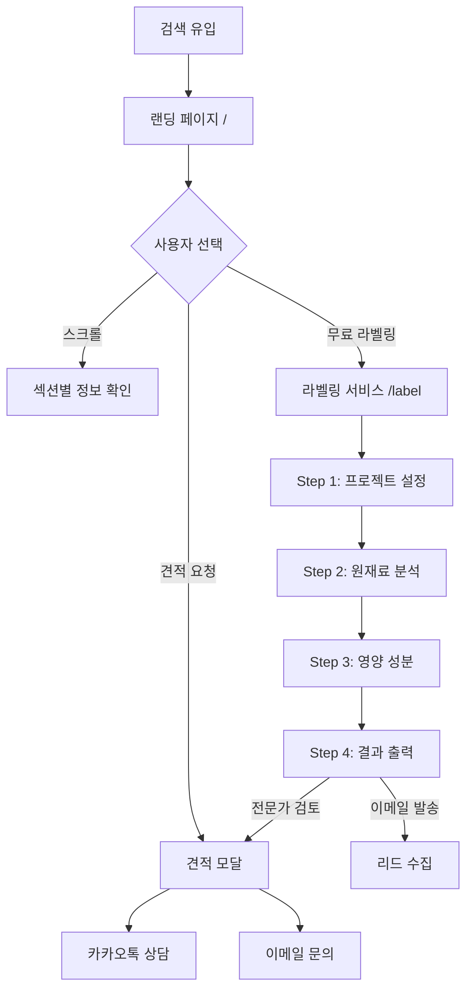

# 화면 명세 (Screens Specification)

> 새봄컨설팅 - 화면별 상세 명세
> /screen-spec 스킬의 입력으로 사용됩니다.

---

## 개요

| 항목               | 내용                                            |
| ------------------ | ----------------------------------------------- |
| **서비스명**       | 새봄컨설팅 (newbom.co.kr)                       |
| **핵심 기능**      | FEAT-1: 랜딩 페이지, FEAT-2: 무료 라벨링 서비스 |
| **총 화면 수**     | 2개 (랜딩, 라벨링)                              |
| **인증 필요 화면** | 0개 (모두 공개)                                 |

---

## 화면 목록

### 1. 랜딩 페이지 (`/`)

| 항목          | 내용                         |
| ------------- | ---------------------------- |
| **화면 ID**   | S-01                         |
| **연결 기능** | FEAT-1: 신뢰 구축, 정보 제공 |
| **인증 필요** | No                           |
| **진입점**    | 검색 유입, 직접 URL          |

#### 1.1 헤더 (Header)

**주요 요소:**

- 로고: 새봄컨설팅 로고 (클릭 시 홈으로)
- 네비게이션:
  - 서비스 → 서비스 섹션 스크롤
  - FDA 인증 → FDA 섹션 스크롤
  - EU 통관 → EU 섹션 스크롤
  - 일본 인증 → 일본 섹션 스크롤
  - 무료 라벨링 → `/label` 페이지 이동
- CTA 버튼: [무료 견적 받기]

**반응형:**

- 모바일: 햄버거 메뉴로 변환
- Sticky: 스크롤 시 상단 고정

---

#### 1.2 히어로 섹션 (Hero)

**주요 요소:**

- 메인 캐치프레이즈: "AI로 더 빠르게, 관세사로 더 정확하게"
- 서브 카피: "해외 수출 인증·허가, 이제 합리적인 비용으로 시작하세요"
- 추가 설명: "FDA, EU, 일본 인증부터 통관까지 원스톱 지원"
- CTA 버튼: [무료 견적 받기]

**사용자 액션:**

- [무료 견적 받기] 클릭 → 견적 요청 섹션으로 스크롤

---

#### 1.3 핵심 가치 제안 섹션 (Value Proposition)

**섹션 타이틀:** "왜 새봄컨설팅인가요?"

**카드 4개:**

| #   | 제목             | 설명                                                                                                                |
| --- | ---------------- | ------------------------------------------------------------------------------------------------------------------- |
| 1   | AI + 전문 관세사 | AI가 신청서를 자동 작성하고, 11년 경력 전문 관세사가 검토합니다. 전문가배상책임보험으로 만일의 손해까지 보상합니다. |
| 2   | 합리적인 비용    | AI 자동화로 기존 업체 대비 50~70% 절감. FDA 160만원, EU 150만원, 일본 50만원                                        |
| 3   | 빠른 처리        | AI 신청서 자동 작성 + 관세사 검토로 평균 30일 내 처리. 기존 60일 대비 50% 단축                                      |
| 4   | 원스톱 지원      | 인증·허가부터 국내 수출통관, 현지 수입통관까지 수출 전 과정을 한 곳에서 해결합니다                                  |

---

#### 1.4 서비스 소개 섹션 (Services)

**섹션 타이틀:** "우리의 서비스"

**카드 3개:**

| #   | 서비스          | 상세                                               | 가격       |
| --- | --------------- | -------------------------------------------------- | ---------- |
| 1   | FDA 인증 (미국) | FDA 시설허가 100만원 + DUNS 10만원 + 라벨링 50만원 | 총 160만원 |
| 2   | EU 통관         | EU 라벨링 100만원 + 원재료 검토 50만원             | 총 150만원 |
| 3   | 일본 인증       | 후생성 등록                                        | 50만원     |

---

#### 1.5 무료 라벨링 섹션 (Free Service)

**섹션 타이틀:** "무료 라벨링 체험"

**주요 요소:**

- 설명: "원재료와 영양정보를 입력하면 EU/미국 규정에 맞는 라벨 초안을 무료로 생성해드립니다"
- CTA 버튼: [무료 라벨링 체험하기]
- 기능 미리보기 이미지 (선택)

**사용자 액션:**

- [무료 라벨링 체험하기] 클릭 → `/label` 페이지 이동

---

#### 1.6 프로세스 섹션 (Process)

**섹션 타이틀:** "간단한 4단계 프로세스"

| Step | 제목                | 설명                                                                       |
| ---- | ------------------- | -------------------------------------------------------------------------- |
| 01   | 문의 및 상담        | 제품 정보와 수출 계획을 알려주세요. 24시간 내 맞춤 견적을 드립니다         |
| 02   | 계약 및 자료 제출   | 필요한 서류와 원재료 정보를 제출하시면 AI가 1차 문서를 자동 생성합니다     |
| 03   | 관세사 검토 및 승인 | 관세사가 직접 검토하고 수정합니다. 법적 효력이 있는 정식 서류로 완성됩니다 |
| 04   | 제출 및 통관 지원   | 현지 파트너와 협력하여 신속 처리. 국내 수출통관까지 원스톱 지원            |

---

#### 1.7 실적 섹션 (Track Record)

**섹션 타이틀:** "믿을 수 있는 실적"

**사례 카드:**

- 국내 대기업 식품회사: EU 라면 8종 라벨링 및 원재료 허가 완료 (2024)
- 중소 식품 수출기업: 미국 FDA 소스·시즈닝 인증 진행 중 (2025)

**통계:**

- 11년 관세사 실무 경력
- 30일 평균 처리 기간
- 160만원 FDA 인증 (기존 대비 93% 절감)

---

#### 1.8 고객 문제 섹션 (Pain Points)

**섹션 타이틀:** "이런 고민 하고 계신가요?"

| #   | 문제                            | 해결책                              |
| --- | ------------------------------- | ----------------------------------- |
| 1   | 💰 컨설팅 비용이 너무 비싸요    | 새봄컨설팅은 160만원부터 시작합니다 |
| 2   | ⏰ 처리 기간이 너무 오래 걸려요 | 평균 30일 내 처리합니다             |
| 3   | ❓ 정확성을 믿을 수 없어요      | 관세사가 직접 검토·승인합니다       |
| 4   | 📋 통관까지 책임져주지 않아요   | 수출통관까지 원스톱 지원합니다      |

---

#### 1.9 차별점 상세 섹션 (Differentiators)

**섹션 타이틀:** "새봄컨설팅이 다른 이유"

**차별점 3가지:**

1. **관세사만의 전문성**: 11년 경력, 전문가배상책임보험, 법적 효력 보장
2. **AI 기술과 전문성의 결합**: AI 1차 생성 + 관세사 검토, 시간 50% 단축
3. **진짜 원스톱 서비스**: 인증·허가 + 수출통관 + 현지 수입통관

---

#### 1.10 FAQ 섹션

**Q&A 6개:**

1. 일반 컨설팅과 무엇이 다른가요?
2. AI가 만든 서류를 그대로 제출하나요?
3. 처리 기간은 얼마나 걸리나요?
4. 비용은 어떻게 책정되나요?
5. 인증 실패하면 어떻게 되나요?
6. 어떤 국가를 지원하나요?

---

#### 1.11 견적 요청 섹션 (CTA)

**섹션 타이틀:** "지금 바로 시작하세요"
**서브 카피:** "24시간 내 맞춤 견적을 보내드립니다. 상담은 언제나 무료입니다."

**CTA 버튼:**

- [무료 견적 받기] → 카카오톡 채널 또는 이메일 선택 모달
- [카카오톡 상담하기] → 카카오톡 채널 새 탭

---

#### 1.12 Footer

**주요 요소:**

- 회사 정보: 새봄컨설팅, 대표, 사업자등록번호, 이메일
- 링크: 서비스 소개, FDA 인증, EU 통관, 일본 인증, 회사 소개
- 법적 고지: 관세사 자격 보유 전문가 운영 안내
- 저작권: © 2025 새봄컨설팅. All rights reserved.

---

### 2. 무료 라벨링 서비스 (`/label`)

| 항목          | 내용                                   |
| ------------- | -------------------------------------- |
| **화면 ID**   | S-02                                   |
| **연결 기능** | FEAT-2: 무료 라벨링 서비스 (리드 수집) |
| **인증 필요** | No                                     |
| **진입점**    | 랜딩 페이지 CTA, 네비게이션 메뉴       |

#### 2.1 Step 1: 프로젝트 설정

**주요 요소:**

- 이메일 입력 (필수) - 리드 수집용
- 제품명 입력
- 수출 대상 마켓 선택 (EU / US)
- 판매 언어 입력

**사용자 액션:**

- [다음 단계] 클릭 → Step 2로 이동

**유효성 검사:**

- 이메일 형식 검증
- 필수 필드 입력 확인

---

#### 2.2 Step 2: 원재료 분석

**주요 요소:**

- 원재료 입력 필드 (이름 + 함량%)
- [추가] 버튼
- 원재료 목록 표시 (중량 내림차순 자동 정렬)
- 알러지 성분 자동 감지 및 강조
- EU 2% 미만 표기 규칙 안내

**사용자 액션:**

- 원재료 추가 → 목록에 반영
- [이전 단계] → Step 1
- [다음 단계] → Step 3

---

#### 2.3 Step 3: 영양 성분 변환

**주요 요소:**

- 8가지 영양성분 입력 (100g 기준)
  - 에너지 (kcal)
  - 나트륨 (mg)
  - 지방 (g)
  - 포화지방 (g)
  - 탄수화물 (g)
  - 당류 (g)
  - 단백질 (g)
  - 식이섬유 (g)
- EU 규정 자동 변환 안내 (나트륨→소금, kcal→kJ)

**사용자 액션:**

- [이전 단계] → Step 2
- [다음 단계] → Step 4 + 이메일 발송

---

#### 2.4 Step 4: 최종 라벨 출력

**주요 요소:**

- 라벨 텍스트 초안 (monospace 폰트)
- 규정 준수 체크리스트
  - ✅ 원재료 중량 순서대로 배열 (FIC Article 18)
  - ✅ 알레르기 유발 물질 강조 표기
  - ✅ 나트륨→소금 변환 (EU)
  - ✅ kJ/kcal 병기 (EU)
  - 등...
- 규정 준수율 (%)

**사용자 액션:**

- [텍스트 복사] → 클립보드 복사
- [PDF 다운로드] → PDF 생성 (선택적)
- [전문가 검토 받기] → 견적 요청 모달
- [이전 단계] → Step 3

**자동 동작:**

- 이메일 자동 발송 (리드 정보 + 라벨 결과)

---

## 화면 흐름도



---

## 화면 연결 매트릭스

| From \ To     | 랜딩 (/) | 라벨링 (/label) | 견적 모달 | 외부 (카톡) |
| ------------- | -------- | --------------- | --------- | ----------- |
| **랜딩**      | -        | ✓               | ✓         | ✓           |
| **라벨링**    | ✓ (헤더) | -               | ✓         | -           |
| **견적 모달** | ✓ (닫기) | -               | -         | ✓           |

---

## 공통 요소

### 헤더 (Header)

- 로고: 새봄컨설팅
- 네비게이션: 서비스, FDA인증, EU통관, 일본인증, 무료라벨링
- CTA: [무료 견적 받기]
- Sticky: 스크롤 시 상단 고정
- 모바일: 햄버거 메뉴

### Footer

- 회사 정보
- 서비스 링크
- 법적 고지
- 저작권

---

## 빈 상태 (Empty States)

| 화면        | 빈 상태 메시지            | CTA |
| ----------- | ------------------------- | --- |
| 원재료 목록 | "원재료를 추가해주세요"   | -   |
| 라벨 결과   | "데이터를 로드하는 중..." | -   |

---

## 에러 상태

| 에러 유형        | 표시 방식             | 사용자 액션 |
| ---------------- | --------------------- | ----------- |
| 이메일 형식 오류 | 필드 아래 빨간 메시지 | 재입력      |
| 필수 입력 누락   | 필드 아래 빨간 메시지 | 입력        |
| 이메일 발송 실패 | 토스트 알림           | 재시도      |
| 네트워크 오류    | 토스트 알림           | 새로고침    |

---

## 반응형 브레이크포인트

| 디바이스 | 너비           | 주요 변화                                 |
| -------- | -------------- | ----------------------------------------- |
| 모바일   | < 768px        | 햄버거 메뉴, 1열 레이아웃, CTA full-width |
| 태블릿   | 768px ~ 1024px | 2열 그리드                                |
| 데스크톱 | > 1024px       | 전체 네비게이션, 3~4열 그리드             |

---

## 다음 단계

이 문서를 기반으로:

1. **`/screen-spec`** 실행 → 각 화면별 상세 YAML 명세 생성
2. **`/tasks-generator`** 실행 → 화면 단위 태스크 생성

```
06-screens.md (이 문서)
    ↓
/screen-spec (선택)
    ↓
specs/screens/*.yaml
    ↓
/tasks-generator
    ↓
TASKS.md
```
