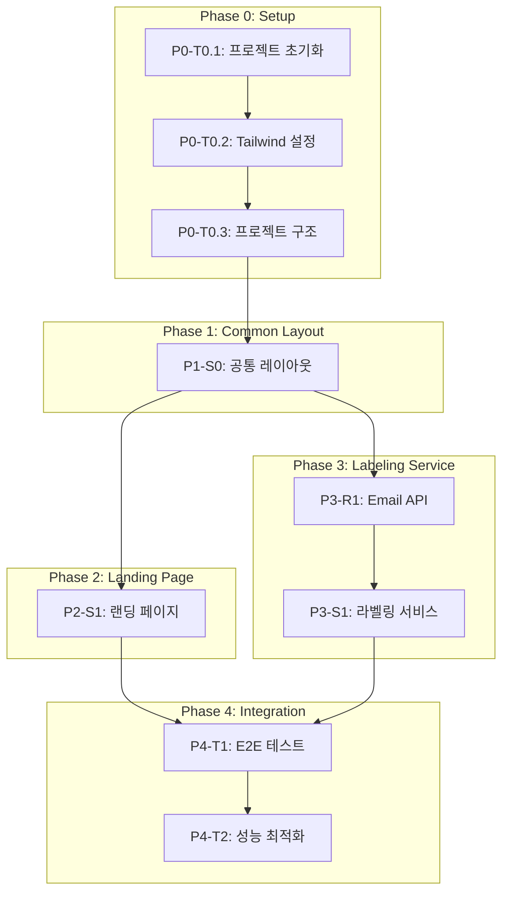

# TASKS.md - 새봄컨설팅 홈페이지

> 화면 단위 개발 태스크 목록
> Reference: insightflo-homepage 디자인 패턴

---

## 프로젝트 개요

| 항목            | 내용                                         |
| --------------- | -------------------------------------------- |
| **프로젝트**    | 새봄컨설팅 홈페이지 (newbom.co.kr)           |
| **기술 스택**   | Astro 4.x + React 18 + Tailwind CSS + Resend |
| **총 화면**     | 2개 (랜딩, 라벨링)                           |
| **배포**        | Vercel                                       |
| **참고 디자인** | /Users/kwak/Projects/ai/insightflo-homepage  |

---

## 의존성 그래프



---

# Phase 0: 프로젝트 셋업

> main 브랜치에서 직접 작업 (Worktree 불필요)

## [x] P0-T0.1: Astro 프로젝트 초기화

- **담당**: frontend-specialist
- **파일**: `package.json`, `astro.config.mjs`, `tsconfig.json`
- **스펙**: Astro 4.x 프로젝트 생성, React + TypeScript 통합
- **명령어**:
  ```bash
  pnpm create astro@latest . --template minimal --typescript strict
  pnpm add @astrojs/react @astrojs/tailwind react react-dom
  pnpm add -D @types/react @types/react-dom
  ```
- **완료 조건**:
  - [ ] `pnpm dev` 실행 시 localhost:4321 접속 가능
  - [ ] React 컴포넌트 렌더링 확인

---

## [x] P0-T0.2: Tailwind CSS + 디자인 시스템 설정

- **담당**: frontend-specialist
- **의존**: P0-T0.1
- **파일**: `tailwind.config.mjs`, `src/styles/global.css`
- **스펙**: insightflo-homepage 스타일 기반 Tailwind 설정
- **디자인 참고**: `docs/planning/05-design-system.md`
- **완료 조건**:
  - [ ] Navy-Blue 컬러 팔레트 설정 (#0F172A, #1E3A5F)
  - [ ] Pretendard 폰트 CDN 연결
  - [ ] Material Symbols Outlined 아이콘 CDN 연결
  - [ ] hero-gradient, tech-pattern 유틸리티 클래스
  - [ ] 커스텀 색상 클래스 (text-navy, bg-deep-blue 등)

---

## [x] P0-T0.3: 프로젝트 구조 및 개발 환경 설정

- **담당**: frontend-specialist
- **의존**: P0-T0.2
- **파일**: 폴더 구조, `.eslintrc.cjs`, `.prettierrc`, `package.json` scripts
- **스펙**: 코딩 컨벤션에 맞는 폴더 구조 생성
- **구조 참고**: `docs/planning/07-coding-convention.md`
- **완료 조건**:
  - [ ] `src/components/{common,landing,label-ai}/` 폴더 생성
  - [ ] `src/lib/{utils,constants,types}.ts` 파일 생성
  - [ ] `src/pages/api/` 폴더 생성
  - [ ] ESLint + Prettier 설정
  - [ ] `pnpm lint` 실행 성공

---

# Phase 1: 공통 레이아웃

## P1-S0: 공통 레이아웃 (Header, Footer, Layout)

> 화면: 전체
> 디자인 참고: insightflo-homepage의 Header.astro, Footer.astro, Layout.astro

### [x] P1-S0-T1: Header 컴포넌트

- **담당**: frontend-specialist
- **의존**: P0-T0.3
- **파일**: `src/components/common/Header.astro`
- **스펙**:
  - Fixed 헤더 (bg-white/90 backdrop-blur)
  - 로고: 새봄컨설팅 (eco 아이콘 + 텍스트)
  - 네비게이션: 서비스, FDA인증, EU통관, 일본인증, 무료라벨링
  - CTA: [무료 견적 받기] 버튼
  - 모바일: 햄버거 메뉴 + 드롭다운
- **Worktree**: `worktree/phase-1-layout`
- **TDD**: RED → GREEN → REFACTOR
- **데모**: `/` 페이지에서 확인
- **완료 조건**:
  - [ ] 데스크톱: 전체 네비게이션 표시
  - [ ] 모바일: 햄버거 메뉴 토글 동작
  - [ ] Sticky 헤더 동작
  - [ ] 네비게이션 링크 앵커 스크롤

---

### [x] P1-S0-T2: Footer 컴포넌트

- **담당**: frontend-specialist
- **의존**: P0-T0.3
- **파일**: `src/components/common/Footer.astro`
- **스펙**:
  - 회사 정보: 새봄컨설팅, 이메일
  - 서비스 링크: FDA인증, EU통관, 일본인증
  - 법적 고지: 관세사 자격 보유 안내
  - 저작권: 동적 연도
- **Worktree**: `worktree/phase-1-layout`
- **TDD**: RED → GREEN → REFACTOR
- **병렬**: P1-S0-T1과 병렬 가능
- **완료 조건**:
  - [ ] 회사 정보 표시
  - [ ] 이메일 링크 동작 (mailto:)
  - [ ] 동적 연도 표시

---

### [x] P1-S0-T3: Layout 컴포넌트

- **담당**: frontend-specialist
- **의존**: P1-S0-T1, P1-S0-T2
- **파일**: `src/layouts/Layout.astro`
- **스펙**:
  - HTML 기본 구조
  - SEO 메타 태그 (title, description, og:image)
  - Pretendard 폰트 CDN
  - Material Symbols CDN
  - Header + main + Footer 구조
- **Worktree**: `worktree/phase-1-layout`
- **TDD**: RED → GREEN → REFACTOR
- **완료 조건**:
  - [ ] title, description props 동작
  - [ ] 폰트 로드 확인
  - [ ] 아이콘 렌더링 확인

---

### [x] P1-S0-V: 공통 레이아웃 검증

- **담당**: test-specialist
- **의존**: P1-S0-T3
- **검증 항목**:
  - [ ] Header: 모든 네비게이션 링크 동작
  - [ ] Header: 모바일 햄버거 메뉴 토글
  - [ ] Footer: 이메일 링크 동작
  - [ ] Layout: 메타 태그 렌더링
  - [ ] Lighthouse Accessibility 점수 ≥ 90

---

# Phase 2: 랜딩 페이지

## P2-S1: 랜딩 페이지 (/)

> 화면: `/`
> 총 섹션: 10개 + Header + Footer
> 디자인 참고: insightflo-homepage 섹션 구조

### [x] P2-S1-T1: Hero 섹션

- **담당**: frontend-specialist
- **의존**: P1-S0-T3
- **파일**: `src/components/landing/Hero.astro`
- **스펙**:
  - hero-gradient 배경 + tech-pattern
  - blur 효과 (bg-blue-500/10 blur-[120px])
  - 메인 캐치프레이즈: "AI로 더 빠르게, 관세사로 더 정확하게"
  - 서브 카피: 해외 수출 인증·허가 안내
  - CTA: [무료 견적 받기], [서비스 보기]
- **Worktree**: `worktree/phase-2-landing`
- **TDD**: RED → GREEN → REFACTOR
- **데모**: `/`
- **완료 조건**:
  - [ ] 그라디언트 배경 + 패턴 렌더링
  - [ ] CTA 버튼 클릭 시 스크롤 동작
  - [ ] 반응형 레이아웃 (모바일/데스크톱)

---

### [x] P2-S1-T2: Value Proposition 섹션

- **담당**: frontend-specialist
- **의존**: P2-S1-T1
- **파일**: `src/components/landing/ValueProposition.astro`
- **스펙**:
  - 섹션 헤더: "Why Choose Us" + "왜 새봄컨설팅인가요?"
  - 4개 하이라이트 카드 (WhyUs 스타일):
    1. AI + 전문 관세사
    2. 합리적인 비용 (160만원)
    3. 빠른 처리 (30일)
    4. 원스톱 지원
  - 호버 효과: bg-slate-50 → bg-blue-50
- **Worktree**: `worktree/phase-2-landing`
- **TDD**: RED → GREEN → REFACTOR
- **병렬**: 다른 섹션과 병렬 가능
- **완료 조건**:
  - [ ] 4개 카드 렌더링
  - [ ] 호버 효과 동작
  - [ ] 반응형: 1열 → 2열 → 4열

---

### [x] P2-S1-T3: Services 섹션

- **담당**: frontend-specialist
- **의존**: P2-S1-T1
- **파일**: `src/components/landing/Services.astro`
- **스펙**:
  - 섹션 헤더: "Our Services" + "우리의 서비스"
  - 3개 서비스 카드 (rounded-3xl):
    1. FDA 인증 (미국) - 160만원
    2. EU 통관 - 150만원
    3. 일본 인증 - 50만원
  - 각 카드: 아이콘 + 제목 + 설명 + 가격 + 체크리스트
- **Worktree**: `worktree/phase-2-landing`
- **TDD**: RED → GREEN → REFACTOR
- **병렬**: P2-S1-T2와 병렬 가능
- **완료 조건**:
  - [ ] 3개 카드 렌더링
  - [ ] 가격 정보 표시
  - [ ] 반응형: 1열 → 2열 → 3열

---

### [x] P2-S1-T4: Free Labeling 섹션

- **담당**: frontend-specialist
- **의존**: P2-S1-T1
- **파일**: `src/components/landing/FreeLabeling.astro`
- **스펙**:
  - 배경: bg-slate-50
  - 섹션 헤더: "무료 라벨링 체험"
  - 설명 텍스트
  - CTA: [무료 라벨링 체험하기] → `/label` 이동
  - 미리보기 이미지 (선택)
- **Worktree**: `worktree/phase-2-landing`
- **TDD**: RED → GREEN → REFACTOR
- **병렬**: 다른 섹션과 병렬 가능
- **완료 조건**:
  - [ ] CTA 버튼 클릭 시 /label 이동
  - [ ] 반응형 레이아웃

---

### [x] P2-S1-T5: Process 섹션

- **담당**: frontend-specialist
- **의존**: P2-S1-T1
- **파일**: `src/components/landing/Process.astro`
- **스펙**:
  - 섹션 헤더: "간단한 4단계 프로세스"
  - 4개 스텝 카드:
    1. 문의 및 상담
    2. 계약 및 자료 제출
    3. 관세사 검토 및 승인
    4. 제출 및 통관 지원
  - 스텝 번호 + 연결선
- **Worktree**: `worktree/phase-2-landing`
- **TDD**: RED → GREEN → REFACTOR
- **병렬**: 다른 섹션과 병렬 가능
- **완료 조건**:
  - [ ] 4개 스텝 렌더링
  - [ ] 스텝 간 연결선 표시
  - [ ] 반응형 레이아웃

---

### [x] P2-S1-T6: Track Record 섹션

- **담당**: frontend-specialist
- **의존**: P2-S1-T1
- **파일**: `src/components/landing/TrackRecord.astro`
- **스펙**:
  - 섹션 헤더: "믿을 수 있는 실적"
  - 사례 카드 2개
  - 통계 하이라이트: 11년 경력, 30일 처리, 160만원
- **Worktree**: `worktree/phase-2-landing`
- **TDD**: RED → GREEN → REFACTOR
- **병렬**: 다른 섹션과 병렬 가능
- **완료 조건**:
  - [ ] 사례 카드 렌더링
  - [ ] 통계 숫자 강조 표시

---

### [x] P2-S1-T7: Pain Points 섹션

- **담당**: frontend-specialist
- **의존**: P2-S1-T1
- **파일**: `src/components/landing/PainPoints.astro`
- **스펙**:
  - 섹션 헤더: "이런 고민 하고 계신가요?"
  - 4개 문제-해결 카드:
    1. 비용 문제 → 160만원부터
    2. 기간 문제 → 30일 내
    3. 정확성 문제 → 관세사 검토
    4. 통관 문제 → 원스톱 지원
- **Worktree**: `worktree/phase-2-landing`
- **TDD**: RED → GREEN → REFACTOR
- **병렬**: 다른 섹션과 병렬 가능
- **완료 조건**:
  - [ ] 4개 문제-해결 카드 렌더링
  - [ ] 반응형 레이아웃

---

### [x] P2-S1-T8: Differentiators 섹션

- **담당**: frontend-specialist
- **의존**: P2-S1-T1
- **파일**: `src/components/landing/Differentiators.astro`
- **스펙**:
  - 섹션 헤더: "새봄컨설팅이 다른 이유"
  - 3개 차별점 카드:
    1. 관세사만의 전문성
    2. AI + 전문성 결합
    3. 진짜 원스톱 서비스
- **Worktree**: `worktree/phase-2-landing`
- **TDD**: RED → GREEN → REFACTOR
- **병렬**: 다른 섹션과 병렬 가능
- **완료 조건**:
  - [ ] 3개 차별점 카드 렌더링

---

### [x] P2-S1-T9: FAQ 섹션

- **담당**: frontend-specialist
- **의존**: P2-S1-T1
- **파일**: `src/components/landing/FAQ.astro`
- **스펙**:
  - 섹션 헤더: "자주 묻는 질문"
  - 6개 Q&A 아코디언
  - 클릭 시 답변 토글
- **Worktree**: `worktree/phase-2-landing`
- **TDD**: RED → GREEN → REFACTOR
- **병렬**: 다른 섹션과 병렬 가능
- **완료 조건**:
  - [ ] 6개 Q&A 렌더링
  - [ ] 아코디언 토글 동작

---

### [x] P2-S1-T10: CTA 섹션

- **담당**: frontend-specialist
- **의존**: P2-S1-T1
- **파일**: `src/components/landing/CTA.astro`
- **스펙**:
  - 섹션 헤더: "지금 바로 시작하세요"
  - 서브 카피: 24시간 내 맞춤 견적 안내
  - CTA 버튼:
    - [무료 견적 받기] → 견적 모달 또는 이메일
    - [카카오톡 상담하기] → 카카오톡 채널 (새 탭)
- **Worktree**: `worktree/phase-2-landing`
- **TDD**: RED → GREEN → REFACTOR
- **병렬**: 다른 섹션과 병렬 가능
- **완료 조건**:
  - [ ] 2개 CTA 버튼 렌더링
  - [ ] 카카오톡 링크 새 탭 열림
  - [ ] 이메일 링크 동작

---

### [x] P2-S1-T11: 랜딩 페이지 통합

- **담당**: frontend-specialist
- **의존**: P2-S1-T1 ~ P2-S1-T10
- **파일**: `src/pages/index.astro`
- **스펙**:
  - Layout 적용
  - 모든 섹션 순서대로 배치
  - SEO 메타 태그 설정
- **Worktree**: `worktree/phase-2-landing`
- **TDD**: RED → GREEN → REFACTOR
- **완료 조건**:
  - [ ] 모든 섹션 렌더링
  - [ ] 스크롤 네비게이션 동작
  - [ ] 메타 태그 확인

---

### [x] P2-S1-V: 랜딩 페이지 검증

- **담당**: test-specialist
- **의존**: P2-S1-T11
- **검증 항목**:
  - [ ] 모든 섹션 렌더링 확인
  - [ ] 네비게이션 앵커 스크롤 동작
  - [ ] CTA 버튼 동작 (스크롤, 링크)
  - [ ] 반응형 레이아웃 (모바일/태블릿/데스크톱)
  - [ ] Lighthouse Performance ≥ 90

---

# Phase 3: 라벨링 서비스

## P3-R1: Email API Resource

> 리소스: lead-email
> 백엔드 유일한 API 엔드포인트

### [ ] P3-R1-T1: Send Lead API 구현

- **담당**: backend-specialist
- **의존**: P0-T0.3
- **파일**: `src/lib/schemas.ts` → `src/pages/api/send-lead.ts`
- **리소스**: lead-email
- **엔드포인트**: POST /api/send-lead
- **스펙**:
  - Zod 스키마로 요청 검증
  - Resend API로 이메일 발송
  - 수신: newbom@newbom.co.kr
  - 에러 응답 형식 통일
- **필드**: email, productName, targetMarket, ingredients, nutrition, labelOutput
- **Worktree**: `worktree/phase-3-labeling`
- **TDD**: RED → GREEN → REFACTOR
- **완료 조건**:
  - [ ] Zod 스키마 정의
  - [ ] Resend 연동 테스트
  - [ ] 성공/실패 응답 형식
  - [ ] 환경 변수 (RESEND_API_KEY) 설정

---

## P3-S1: 라벨링 서비스 (/label)

> 화면: `/label`
> React Island (client:load)
> 4단계 위저드 UI

### [ ] P3-S1-T1: Step 1 - 프로젝트 설정

- **담당**: frontend-specialist
- **의존**: P1-S0-T3
- **파일**: `src/components/label-ai/Step1.tsx`
- **스펙**:
  - 이메일 입력 (필수) - 리드 수집
  - 제품명 입력
  - 수출 대상 마켓 선택 (EU / US)
  - 판매 언어 입력
  - 유효성 검사 (이메일 형식)
  - [다음 단계] 버튼
- **Worktree**: `worktree/phase-3-labeling`
- **TDD**: RED → GREEN → REFACTOR
- **데모**: `/label`
- **완료 조건**:
  - [ ] 4개 입력 필드 렌더링
  - [ ] 이메일 유효성 검사
  - [ ] 다음 단계 이동

---

### [ ] P3-S1-T2: Step 2 - 원재료 분석

- **담당**: frontend-specialist
- **의존**: P3-S1-T1
- **파일**: `src/components/label-ai/Step2.tsx`
- **스펙**:
  - 원재료 입력 (이름 + 함량%)
  - [추가] 버튼
  - 원재료 목록 (중량 내림차순 자동 정렬)
  - 알러지 성분 자동 감지 및 강조 (EU 14대 알러젠)
  - EU 2% 미만 표기 규칙 안내
  - [이전 단계], [다음 단계] 버튼
- **Worktree**: `worktree/phase-3-labeling`
- **TDD**: RED → GREEN → REFACTOR
- **완료 조건**:
  - [ ] 원재료 추가/삭제 동작
  - [ ] 자동 정렬 동작
  - [ ] 알러지 성분 강조 표시

---

### [ ] P3-S1-T3: Step 3 - 영양 성분 변환

- **담당**: frontend-specialist
- **의존**: P3-S1-T2
- **파일**: `src/components/label-ai/Step3.tsx`
- **스펙**:
  - 8가지 영양성분 입력 (100g 기준)
    - 에너지 (kcal), 나트륨 (mg), 지방 (g), 포화지방 (g)
    - 탄수화물 (g), 당류 (g), 단백질 (g), 식이섬유 (g)
  - EU 규정 자동 변환 안내 (나트륨→소금, kcal→kJ)
  - [이전 단계], [다음 단계] 버튼
- **Worktree**: `worktree/phase-3-labeling`
- **TDD**: RED → GREEN → REFACTOR
- **완료 조건**:
  - [ ] 8개 입력 필드 렌더링
  - [ ] 나트륨→소금 변환 로직
  - [ ] kcal→kJ 변환 로직

---

### [ ] P3-S1-T4: Step 4 - 최종 라벨 출력

- **담당**: frontend-specialist
- **의존**: P3-S1-T3, P3-R1-T1
- **파일**: `src/components/label-ai/Step4.tsx`
- **스펙**:
  - 라벨 텍스트 초안 (monospace 폰트)
  - 규정 준수 체크리스트 표시
  - 규정 준수율 (%)
  - [텍스트 복사] 버튼
  - [전문가 검토 받기] → 견적 CTA
  - 자동 이메일 발송 (API 호출)
- **Worktree**: `worktree/phase-3-labeling`
- **TDD**: RED → GREEN → REFACTOR
- **완료 조건**:
  - [ ] 라벨 텍스트 렌더링
  - [ ] 체크리스트 표시
  - [ ] 클립보드 복사 동작
  - [ ] API 호출 및 성공/실패 처리

---

### [ ] P3-S1-T5: LabelAI 컨테이너

- **담당**: frontend-specialist
- **의존**: P3-S1-T1 ~ P3-S1-T4
- **파일**: `src/components/label-ai/LabelAI.tsx`, `src/pages/label.astro`
- **스펙**:
  - Step Indicator (진행 표시기)
  - 4개 스텝 상태 관리 (useLabelForm 훅)
  - 스텝 간 데이터 전달
  - client:load로 하이드레이션
- **Worktree**: `worktree/phase-3-labeling`
- **TDD**: RED → GREEN → REFACTOR
- **완료 조건**:
  - [ ] Step Indicator 렌더링
  - [ ] 스텝 이동 동작
  - [ ] 전체 흐름 완료 가능

---

### [ ] P3-S1-V: 라벨링 서비스 검증

- **담당**: test-specialist
- **의존**: P3-S1-T5
- **검증 항목**:
  - [ ] Step 1: 이메일 유효성 검사 동작
  - [ ] Step 2: 원재료 추가/정렬/알러지 감지
  - [ ] Step 3: 영양성분 변환 (나트륨→소금)
  - [ ] Step 4: 라벨 출력 + 클립보드 복사
  - [ ] API: /api/send-lead 정상 응답
  - [ ] 전체 흐름: 4단계 완료 후 이메일 발송

---

# Phase 4: 통합 및 테스트

### [ ] P4-T1: E2E 테스트

- **담당**: test-specialist
- **의존**: P2-S1-V, P3-S1-V
- **파일**: `e2e/landing.spec.ts`, `e2e/labeling.spec.ts`
- **스펙**:
  - 랜딩 페이지 로드 테스트
  - 네비게이션 동작 테스트
  - 라벨링 4단계 완료 테스트
  - 이메일 입력 유효성 테스트
- **Worktree**: `worktree/phase-4-integration`
- **TDD**: Playwright 테스트
- **완료 조건**:
  - [ ] 모든 E2E 테스트 통과
  - [ ] CI에서 실행 가능

---

### [ ] P4-T2: 성능 최적화 및 배포 준비

- **담당**: frontend-specialist
- **의존**: P4-T1
- **파일**: `astro.config.mjs`, `public/robots.txt`, `public/sitemap.xml`
- **스펙**:
  - Lighthouse 점수 최적화 (Performance ≥ 90)
  - 이미지 최적화 (Astro Image)
  - SEO: robots.txt, sitemap.xml
  - 메타 태그 최종 확인
  - Vercel 배포 설정
- **Worktree**: `worktree/phase-4-integration`
- **완료 조건**:
  - [ ] Lighthouse Performance ≥ 90
  - [ ] Lighthouse Accessibility ≥ 90
  - [ ] robots.txt, sitemap.xml 생성
  - [ ] Vercel 배포 성공

---

## 병렬 실행 그룹

| Phase | 그룹             | 태스크               | 병렬 가능            |
| ----- | ---------------- | -------------------- | -------------------- |
| P0    | Setup            | T0.1 → T0.2 → T0.3   | 순차                 |
| P1    | Layout           | S0-T1, S0-T2         | ✅ 병렬              |
| P2    | Landing Sections | S1-T2 ~ S1-T10       | ✅ 병렬 (T1 완료 후) |
| P3    | Labeling         | R1-T1, S1-T1         | ✅ 병렬              |
| P3    | Labeling Steps   | S1-T1 → T2 → T3 → T4 | 순차                 |
| P4    | Integration      | T1 → T2              | 순차                 |

---

## 완료 체크리스트

### Phase 0 완료 조건

- [ ] Astro 프로젝트 실행 가능
- [ ] Tailwind + 디자인 시스템 설정 완료
- [ ] 폴더 구조 및 린터 설정 완료

### Phase 1 완료 조건

- [ ] Header 컴포넌트 (반응형)
- [ ] Footer 컴포넌트
- [ ] Layout 컴포넌트 (SEO 포함)

### Phase 2 완료 조건

- [ ] 랜딩 페이지 10개 섹션 구현
- [ ] 네비게이션 앵커 스크롤 동작
- [ ] 반응형 레이아웃 완성

### Phase 3 완료 조건

- [ ] Send Lead API 동작
- [ ] 라벨링 4단계 완료 가능
- [ ] 이메일 자동 발송 동작

### Phase 4 완료 조건

- [ ] E2E 테스트 통과
- [ ] Lighthouse 점수 ≥ 90
- [ ] Vercel 배포 완료

---

## 참고 자료

- **디자인 참고**: `/Users/kwak/Projects/ai/insightflo-homepage`
- **디자인 시스템**: `docs/planning/05-design-system.md`
- **화면 명세**: `docs/planning/06-screens.md`
- **코딩 컨벤션**: `docs/planning/07-coding-convention.md`
